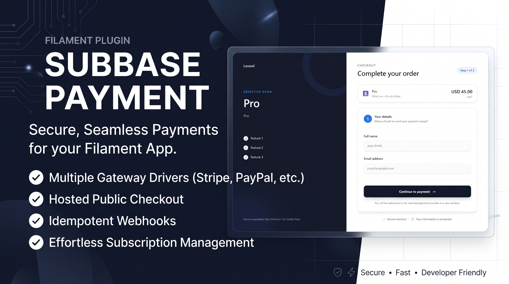
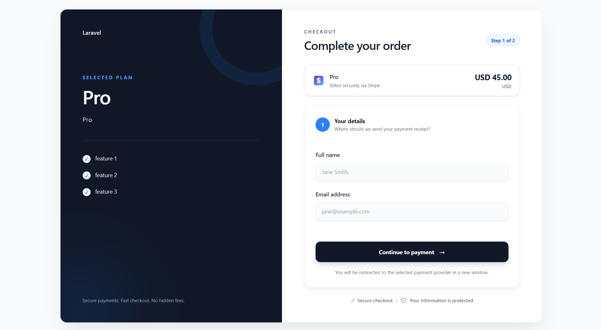
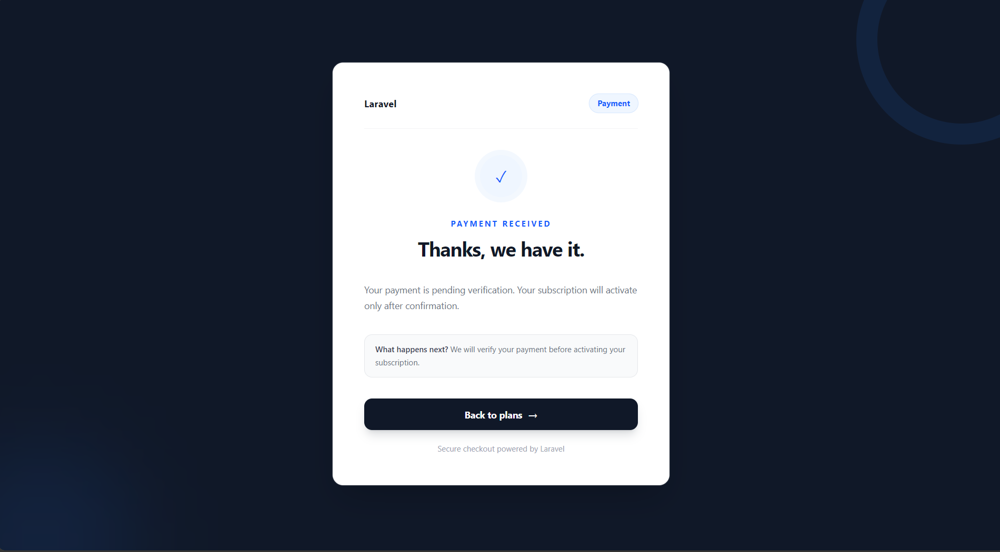
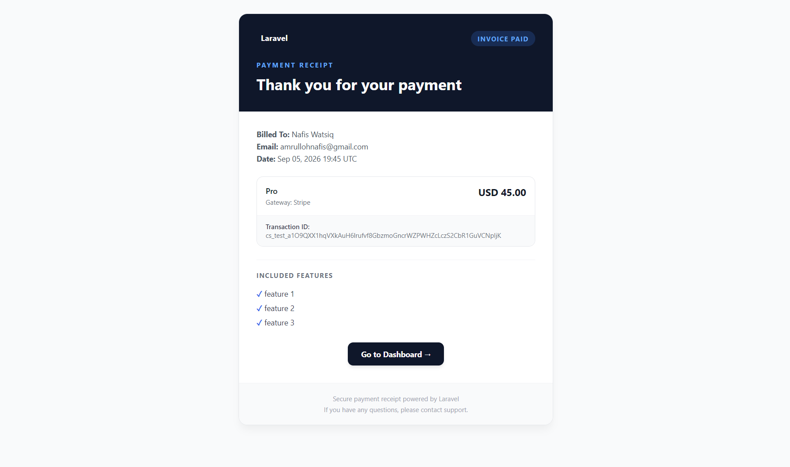
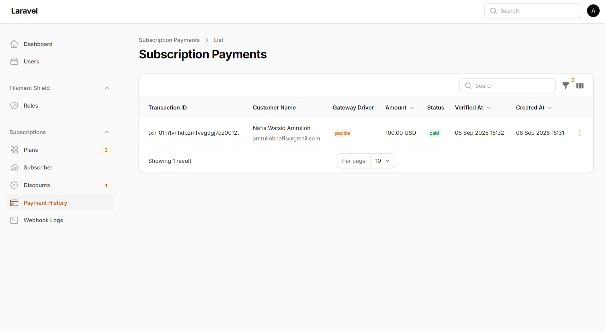
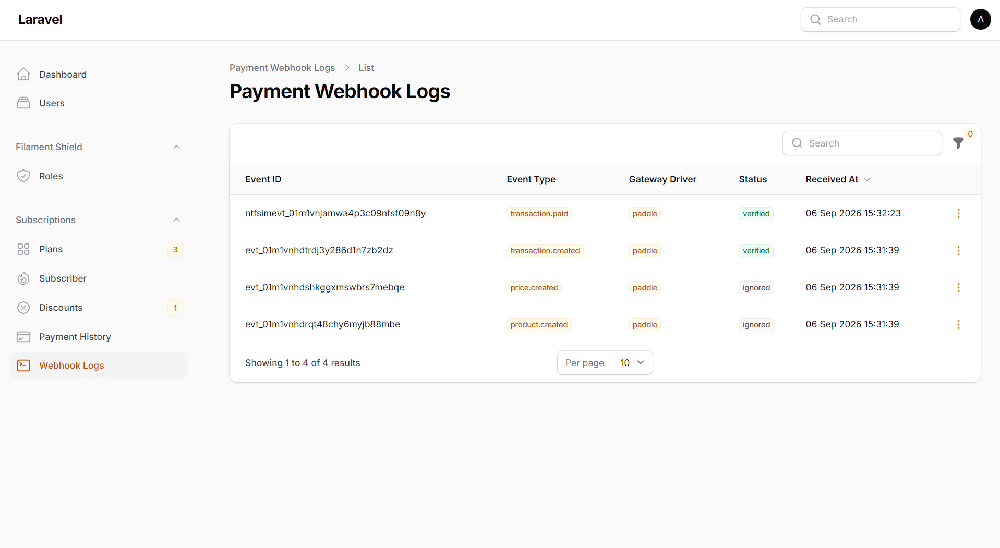

# Subbase Payment - Payment Gateway Plugin for Subbase

[](https://packagist.org/packages/nafiswatsiq/subbase-payment)
[](LICENSE)
[](https://packagist.org/packages/nafiswatsiq/subbase-payment)

### Checkout Page Preview


### Payment Status Page Preview


### Invoice Mail Preview


### Payment History & Webhook Logs



Payment gateway integrations for [`nafiswatsiq/subbase`](https://github.com/nafiswatsiq/subbase). Out-of-the-box support for popular gateways, public checkout pages, webhook handling, and payment events for subscription activation.

> **Quick links:** [Features](#features) · [Requirements](#requirements) · [Installation](#installation) · [Public Checkout](#public-checkout) · [Events](#events--subscription-lifecycle) · [Email Invoices](#email-invoices) · [Configuration](#configuration)

---

## Features

- 💳 **Multiple Gateway Drivers** — Built-in support for PayPal, Stripe, Midtrans, Xendit, and Paddle.
- ⚙️ **Custom Gateway Support** — Extensible architecture to build your own payment driver.
- 🛒 **Hosted Public Checkout** — Modern, responsive checkout UI automatically connected with Subbase plan components.
- 🔔 **Idempotent Webhooks** — Secure, signature-verified webhook handling to update payment status safely.
- ⚡ **Automated CLI Setup** — Interactively install, configure, reset, or switch gateway drivers via `php artisan subbase-payment:install`.
- 📧 **Email Invoices** — Optional email receipt/invoice delivery upon verified payment completion.
- 🔄 **Custom Redirect Flow** — Easily redirect customers to named routes or external URLs after payment.

---

## Requirements

- PHP 8.2+
- Laravel 13.0+
- Filament 5.0
- [`nafiswatsiq/subbase`](https://github.com/nafiswatsiq/subbase) ^1.3

---

## Installation

### 1. Install via Composer

```bash
composer require nafiswatsiq/subbase-payment
```

### 2. Publish Configuration & Migrations

```bash
php artisan vendor:publish --tag=subbase-payment-config
```

```bash
php artisan vendor:publish --tag=subbase-payment-migrations
```

### 3. Interactive Gateway Installer

Run the interactive installer to configure your driver:

```bash
php artisan subbase-payment:install
```

Or pass the driver explicitly:

```bash
php artisan subbase-payment:install --driver=paypal
```

#### Available Drivers for `--driver`:
- `paypal` — PayPal REST API Gateway
- `stripe` — Stripe Checkout Sessions Gateway
- `midtrans` — Midtrans Snap Gateway (Indonesia)
- `xendit` — Xendit Invoice Gateway (SE Asia)
- `paddle` — Paddle Billing Gateway (v2 API)
- `custom` — Custom/Manual Gateway Driver

**CI / Non-interactive setup:**
```bash
php artisan subbase-payment:install --driver=paypal --no-interaction
```

The install command updates your `.env` file with `SUBBASE_PAYMENT_DRIVER` and the corresponding provider credentials.

### 4. Run Migrations

```bash
php artisan migrate
```

---

### Reset / Switch Driver

Reset current driver configuration and clear driver env keys:
```bash
php artisan subbase-payment:reset
```

Reset and immediately switch to another driver:
```bash
php artisan subbase-payment:reset --driver=stripe --force
```

---

## Public Checkout

Auto-links from Subbase `<x-subbase::plan-list />` component:

```
/checkout/{plan-slug}
```

Route name: `subbase-payment.checkout`  
Customize path/middleware/redirects in `config/subbase-payment.php`:
```php
'checkout' => [
    'path' => 'checkout',
    'middleware' => ['web'],
    'return_url' => null,  // named route or full URL after successful payment
    'cancel_url' => null,  // named route or full URL after canceled payment
],
```

Page shows plan features, locale-aware price, collects name/email before payment.

### Custom Redirect After Payment

Set `return_url` / `cancel_url` to override the default status page:

| Value | Behavior |
|-------|----------|
| `null` (default) | Show built-in status page (`status.blade.php`) |
| Named route (e.g. `dashboard`) | `redirect()->route('dashboard', $plan->slug)` |
| Full URL (e.g. `https://app.example/success`) | `redirect()->away('https://app.example/success')` |

**Example — redirect to dashboard after payment:**
```php
'checkout' => [
    'return_url' => 'dashboard',
    'cancel_url' => 'plans.index',
],
```

**Example — external URLs:**
```php
'checkout' => [
    'return_url' => 'https://app.example.com/payment/success',
    'cancel_url' => 'https://app.example.com/payment/cancel',
],
```

---

## Events & Subscription Lifecycle

Webhook verifies payment → dispatches `PaymentReceived` event.

**Handle in your app (e.g. `AppServiceProvider`):**
```php
use Nafiswatsiq\SubbasePayment\Events\PaymentReceived;
use Nafiswatsiq\Subbase\Models\Plan;
use Illuminate\Support\Facades\Event;

Event::listen(PaymentReceived::class, function (PaymentReceived $event) {
    $payment = $event->paymentRecord;
    $planId  = $event->metadata['plan_id'] ?? null;

    $user = \App\Models\User::where('email', $payment->customer_email)->first();
    $plan = Plan::find($planId);

    if ($user && $plan) {
        $user->newSubscription('default', $plan);
    }
});
```

---

## Payment Driver & Documentation

| Payment | Payment Driver | Driver Option | Guide |
|:---:|--------|:---:|-------|
|  | **PayPal** | `paypal` | [PayPal Setup Guide](docs/drivers/paypal.md) |
|  | **Stripe** | `stripe` | [Stripe Setup Guide](docs/drivers/stripe.md) |
|  | **Midtrans** | `midtrans` | [Midtrans Setup Guide](docs/drivers/midtrans.md) |
|  | **Xendit** | `xendit` | [Xendit Setup Guide](docs/drivers/xendit.md) |
|  | **Paddle** | `paddle` | [Paddle Setup Guide](docs/drivers/paddle.md) |
| ⚙️ | **Custom** | `custom` | [Custom Gateway Guide](docs/drivers/custom.md) |

---

## Configuration

Published `config/subbase-payment.php`:

| Key | Default | Description |
|-----|---------|-------------|
| `driver` | `null` | Selected gateway (`paypal`, `stripe`, `midtrans`, etc.) |
| `checkout.path` | `checkout` | Public checkout URL prefix |
| `checkout.middleware` | `['web']` | Middleware on checkout routes |
| `checkout.return_url` | `null` | Named route or full URL after successful payment |
| `checkout.cancel_url` | `null` | Named route or full URL after canceled payment |
| `mail.send_invoice` | `false` | Send email invoice to buyer on verified payment |
| `webhook.path` | `subbase-payment/webhook` | Webhook endpoint path |
| `webhook.middleware` | `[]` | Middleware on webhook (keep empty for PayPal) |
| `gateways` | `[]` | Per-gateway config (see driver guides) |

---

## Email Invoices

Optional email invoice sending to customer upon verified payment. Disabled by default.

### Enable via `.env`

Add to your `.env` file:
```env
SUBBASE_PAYMENT_SEND_INVOICE=true
```

### Enable via Configuration

Or update `config/subbase-payment.php`:
```php
'mail' => [
    'send_invoice' => true,
],
```

The email view can be published and customized using:
```bash
php artisan vendor:publish --tag=subbase-payment-views
```
Look for `resources/views/vendor/subbase-payment/mail/invoice.blade.php`.

---

## Publishing Assets & Views

Publish configuration file:
```bash
php artisan vendor:publish --tag=subbase-payment-config
```

Publish Blade views (`checkout.blade.php`, `status.blade.php` to `resources/views/vendor/subbase-payment`):
```bash
php artisan vendor:publish --tag=subbase-payment-views
```

---

## Development

```bash
composer install
composer validate --strict
composer test
```

---

## Support

- 📖 Documentation: [GitHub Wiki](https://github.com/nafiswatsiq/subbase-payment/wiki)
- 🐛 Issues: [GitHub Issues](https://github.com/nafiswatsiq/subbase-payment/issues)
- 💬 Discussions: [GitHub Discussions](https://github.com/nafiswatsiq/subbase-payment/discussions)

## License

The MIT License (MIT). Please see [License File](LICENSE) for more information.

